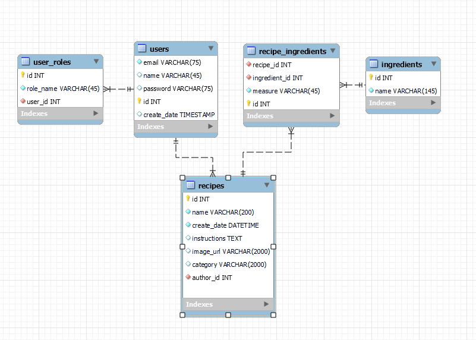

# Capstone Project: Recipe's Site

This Java Spring Boot capstone project implements a Recipe's Site, featuring various functionalities. 

- Utilizes java Spring controllers, JSP pages
- Implements authentication using Spring Web Security.

## Features:

### 1. Home/Search/List Recipes:
- Implements paging for an organized display of recipes. Has the ability to show recipes by categories.

### 2. Add/Edit Recipe Form:
- Supports file uploads (developed custom validation for size check using MultipartFile).
- Dynamic add/remove fields for ingredients.
- Utilizes an external jQuery library for autocompleting ingredient names ([jQuery Autocomplete](https://api.jqueryui.com/autocomplete/)).

### 3. Recipe's Detail Page:
- Provides detailed information about a specific recipe.

### 4. Add/Search Ingredients:
- Implements paging and sorting by ingredient's name (asc, desc).

### 5. Page with Recipes Created by the Logged-in User:
- Displays recipes created by the logged-in user.

### 6. Login/Register Page:
- Allows users to log in or register.

### User Roles:

1. **Anonymous User:**
    - Can view and search recipes and ingredients.

2. **Authorized User:**
    - Can view and search recipes and ingredients.
    - Can create/edit/delete own recipes.
    - Can bookmark any recipe and view them in favorite list  
    - Has access to a page displaying their own recipes.

3. **Admin User:**
    - Has all authorized user's access.
    - Can create/edit ingredients.
    - Has the authority to delete users.

Designed data model

