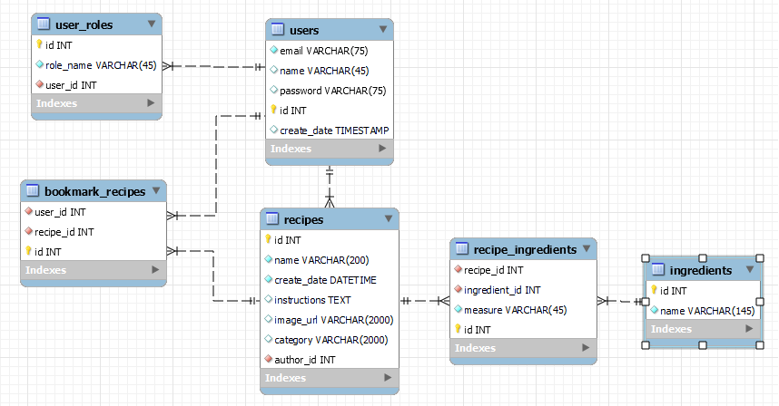

# Capstone Project: Recipe's Site

This Java Spring Boot capstone project implements a Recipe's Site, featuring various functionalities. Feel free to explore, contribute, and enhance the project!

- Utilizes Spring controllers.
- Implemented authentication using spring web securities

## Features:

### 1. Home/Search/List Recipes:
- Implements paging for an organized display of recipes.

### 2. Add/Edit Recipe Form:
- Supports file uploads (designed custom validation for size MultipartFile).
- Dynamic fields for ingredients.
- Utilizes an external jQuery library for autocompleting ingredient names.

### 3. Recipe's Detail Page:
- Provides detailed information about a specific recipe.

### 4. Add/Search Ingredients:
- Implements paging and sorting by name (asc, desc).

### 5. Page with Recipes Created by the Logged-in User:
- Displays recipes created by the logged-in user.

### 6. Login/Register Page:
- Allows users to log in or register.

### User Roles:

1. **Anonymous User:**
    - Can view and search recipes and ingredients.

2. **Authorized User:**
    - Can view and search recipes and ingredients.
    - Can create/edit/delete own recipes.
    - Has access to a page displaying their own recipes.

3. **Admin User:**
    - Have all authorized user's accesss  
    - Can create/edit  ingredients.
    - Has the authority to delete users.

Designed data model 
